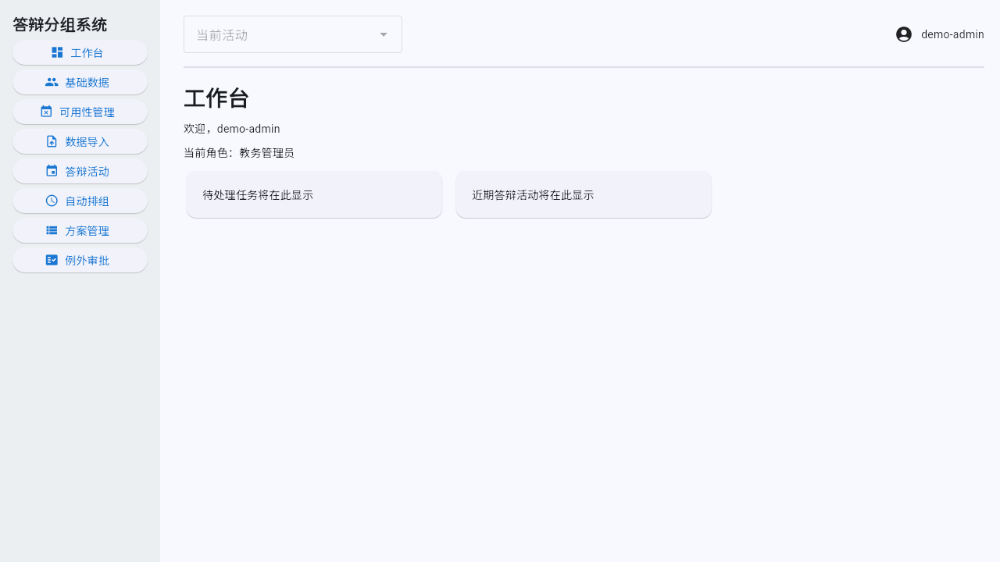

# 首版与完整界面验收记录

验证日期：2026-09-18 至 2026-09-19（Asia/Shanghai）
首个自动发布基线：`32eb008328cfc942a05ce30843e75678f6fbe4d0`
平台：Manjaro Linux 6.12.108-1-MANJARO x86_64，glibc 2.44  
运行时：Python 3.13.9，SQLite 3.50.4，PostgreSQL 17（testcontainers），Docker 29.7.2  
关键库：Flet 1.0.0，SQLAlchemy 2.0.54，OR-Tools 9.15.6755

## 自动化证据

| 完成定义 | 证据 |
| --- | --- |
| 新环境安装、初始化、启动、登录 | README 与 `docs/operations/local-development.md`；CLI、迁移、认证及启动 smoke 测试 |
| 三级角色与院系隔离 | `tests/integration/test_auth_api.py`、`test_master_data_api.py`、客户端导航测试 |
| 六类 Excel 模板与事务导入 | `tests/integration/test_imports.py` |
| 完整排组方案 | 17 个 solver/precheck/validator 测试和 schedule job 集成测试 |
| 硬约束不可绕过 | solver、validator、人工调整和发布回滚测试 |
| 双人例外、撤销、审计、导出 | approvals、audit/export 集成测试 |
| 方案比较、调整、复检、发布、导出 | plan lifecycle 与 E2E 测试 |
| 完整 Flet 操作界面 | `tests/client/test_interactive_views.py` 与真实 API/数据库控制流测试 |
| 浏览器保持登录 | 单元测试；真实浏览器完成刷新、新页面、Web 服务重启和退出后的检查 |
| 院系性能 | 500 学生、50 教师、20 组、8 时段、24 教室；23.48 s wall、21.90 s solver、719.8 MiB peak RSS |
| 后端、客户端、迁移 | 完整套件 113 passed、1 conditional skip；PostgreSQL 专项另行验证 |
| SQLite/PostgreSQL 运维 | `docs/operations/` 五份操作指南 |
| PR、ruleset、性能、Release | repository contract 11 passed；远端 ruleset 已启用并通过实际 PR 验证 |
| 中文 Wiki | 9 个页面已发布到 GitHub Wiki，仓库内保留相同源文件 |

执行记录：

```text
uv run ruff format --check .      134 files already formatted
uv run ruff check .               All checks passed
uv run mypy src                   Success: 75 source files
uv run pytest -q                  113 passed, 1 skipped, 1 warning
RUN_POSTGRES_TESTS=1 uv run pytest tests/integration/test_postgres.py -q
                                    1 passed in 67.16s
uv run pytest tests/repository -q  11 passed
uv run pytest tests/performance/test_department_scale.py -q -m performance -s
                                    1 passed in 24.62s
uv run alembic check               No new upgrade operations detected
uv run flet build web --yes        Successfully built build/web
uv build                           wheel and source distribution built
```

唯一测试警告来自 Starlette `TestClient` 对 AnyIO 旧别名的上游弃用提示，不影响行为。
普通完整套件中的一个 skip 是显式 Docker 条件；同一 PostgreSQL 测试已在启用条件后实测通过。

## Web 界面与登录恢复证据

真实浏览器使用演示管理员完成了以下顺序：

1. 输入临时密码并登录；
2. 按要求修改密码并进入工作台；
3. 硬刷新，仍回到工作台；
4. 在同一浏览器中新开页面，仍回到工作台；
5. 重启 Flet Web 服务后重新访问，仍回到工作台；
6. 主动退出后刷新，只显示登录页。

截图不包含密码、访问凭据或刷新凭据：



早期 Web 启动检查截图：


桌面模式使用相同的 Flet 页面和 API 客户端，但登录凭据保存在操作系统密钥环。
各目标 OS 的最终桌面安装包及截图必须在该 OS 上构建和发布验收，因为 PyInstaller
不是交叉编译器。

## 远端检查点

workflow commit `cb8884154dcb7b9c58a70dfceb2f384025d4bc35` 的 CI run
`35336511018` 全部成功。随后创建并启用 ruleset `23652785`，名称为
`main-branch-protection`，目标为默认分支。第一次 API 回读发现 GitHub 为新版 Pull Request
规则补入两个默认字段，因此修正通过该 ruleset 保护下的 Pull Request #1 提交。

Pull Request #1 的 CI run `35337598697` 全部成功，包含最终 `PR Gate`。PR 以 squash 方式
合并为 `6b093e7cbce76082feafd16d1e82200d80b11084`；该 main commit 的 CI run
`35338000686` 也全部成功。之后应用最终 ruleset 并再次 dry-run，输出为：

```text
ruleset unchanged: JimmyWang0417/defense-grouping-system
```

API 最终回读确认 ruleset 为 `active`，无 bypass actor，要求 Pull Request、解决全部审查对话、
严格通过 `PR Gate`，仅允许 squash/rebase，并禁止删除默认分支与强推。单 owner 仓库不强制
他人批准，也不要求“无法归属的修改”额外批准。

owner 创建 `RELEASE_PLEASE_TOKEN` 后，发布 PR #3 修正了版本文件同步并通过 ruleset 合并。
main commit `32eb008328cfc942a05ce30843e75678f6fbe4d0` 的 CI run `35342190799` 全部成功；
Release run `35342190834` 的等待门禁、Release Please 和构建附件三个 job 也全部成功。
GitHub Release `defense-grouping-system-v0.2.0` 已发布，附件为：

- `defense_grouping_system-0.2.0-py3-none-any.whl`
- `defense_grouping_system-0.2.0.tar.gz`

GitHub API 回读确认仓库只有名为 `RELEASE_PLEASE_TOKEN` 的 Actions secret，API 不会返回其值。

中文 Wiki 的 9 个页面已从 `docs/wiki/` 发布到
`defense-grouping-system.wiki.git`，发布提交为 `c85f119`。以后先修改仓库内源文件并经 PR
合并，再把同一内容同步到 Wiki，避免网页内容和仓库内容不一致。
